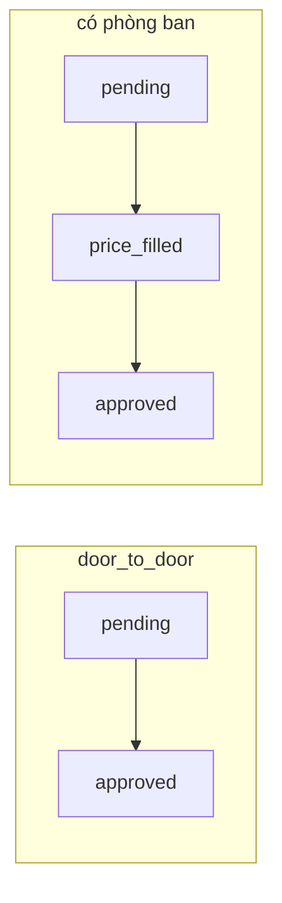

# Brief — Xử lý yêu cầu điều xe (Staff `/mng`)

**Ngữ cảnh:** Trang `/mng/requests/:id` đã gỡ (redirect về danh sách). API và component nghiệp vụ vẫn còn. Brief này mô tả **cần xây gì** để điều vận/admin làm việc trên phiếu mà không phụ thuộc UI cũ.

**Tham chiếu code (tái sử dụng):**

| Khối | Đường dẫn |
|------|-----------|
| Chi tiết dept (mẫu hành vi duyệt ĐV) | `resources/js/src/views/requests/RequestDetailView.vue` (chỉ route `deptRequestDetail`) |
| Chi tiết portal (mẫu timeline + action center) | `resources/js/src/views/portal/PortalRequestDetailView.vue` |
| API staff | `resources/js/src/api/requests.js` |
| Composable docs/OCR | `useDispatchRequestDocs.js`, `useRequestCostEstimate.js` |
| Composable việc cần làm | `useRequestWorkflowSteps.js` |
| BM.03 / điền giá / hồ sơ | `RequestBm03FormTab.vue`, `PriceFillSection.vue`, `RequestDocsPanel.vue` |
| Shell detail (staff) | `components/requests/detail/*` |
| Danh sách hiện tại | `RequestsListView.vue` |
| Bảng điều vận | `DispatcherBoardView.vue` (trip-centric, link sang `/requests?status=pending`) |

---

## 1. Mục tiêu sản phẩm

1. **Một nơi (hoặc một luồng rõ)** để staff xem phiếu, biết bước hiện tại và thực hiện hành động được phép.
2. **Không đổi backend domain** — trạng thái, quyền Spatie, BM.03 (`wizard_snapshot`), idempotency trên POST nhạy cảm.
3. **Deep link** — URL có thể mở đúng phiếu / đúng “việc cần làm” (query `focus`, `tab`, v.v.).
4. **Liên kết chuyến** — sau duyệt, đi tới `trip` khi có; từ trip quay lại ngữ cảnh phiếu (nếu vẫn cần).

**Không bắt buộc:** Gộp với chi tiết chuyến; thay BM.03 bằng form khác.

---

## 2. Đối tượng & quyền

| Vai trò | Việc trên phiếu (staff) |
|---------|-------------------------|
| **Dispatcher / admin** | Duyệt cửa–cửa; điền giá + chọn trưởng ĐV; quản lý hồ sơ (đính kèm, OCR, scan, nhận bản cứng); xuất PDF; xem audit. |
| **Người đề nghị (NV nội bộ)** | Xem trạng thái; upload phiếu đã ký (sau duyệt); clone/tạo lại từ bản approved/rejected (nếu `request.create`). |
| **Trưởng đơn vị** | **Không dùng `/mng`** — duyệt tại `/dept/requests/:id` (`request.approve_dept`, `price_filled`). |

**Feature gate:** `module.operations`, `canAccessDispatchWebApp`.

**Permission map (seed `RbacSeeder.php`):**

| Permission | Hành động UI |
|------------|----------------|
| `request.approve` | Duyệt/từ chối **cửa–cửa** (`pending`, `door_to_door`) |
| `request.fill_price` | Điền giá phiếu **có phòng ban** (`pending`, không D2D) → `price_filled` |
| `request.paper.manage` | OCR/verify signed doc, xác nhận nhận giấy cứng |
| `attachment.upload` | Upload/xóa đính kèm, chạy OCR attachment |
| `request.create` | Clone / wizard thay thế |
| `reference_pricing.manage` | Link quản lý bảng giá (tham chiếu khi điền giá) |

---

## 3. Trạng thái & hai pipeline

`draft` → `pending` → (`price_filled` nếu **không** D2D) → `approved` | `rejected` | `cancelled`.

**Timeline UI:** Phân nhánh D2D vs có phòng ban (logic tương tự `usePortalTimelineSteps.js`).

**Sau `approved`:** PDF; luồng ký → scan → `paper_status`; liên kết `trip`.

**Định kỳ / CLB:** `dispatch_request_template_id` — trên **mng** chủ yếu **xem** số HS; sửa/submit trên **portal** (và bảng extracurricular trên list).

---

## 4. Ma trận hành động (staff)

| Trạng thái | Loại chuyến | Ai | Hành động | API (staff) |
|------------|-------------|-----|-----------|-------------|
| `pending` | D2D | `request.approve` | Approve / Reject | `POST …/decision` + idempotency |
| `pending` | Không D2D | `request.fill_price` | Điền giá, gán trưởng ĐV | `PATCH …/fill-price`, `GET …/available-dept-heads`, gợi ý `PATCH …/pricing-hints` |
| `price_filled` | Không D2D | — | *Chỉ dept* | — |
| `approved` | Mọi | Requester | Upload phiếu đã ký | Portal API hoặc staff signed-doc flow nếu có |
| `approved` | Mọi | `attachment.upload` | Đính kèm, scan, OCR | `api/attachments`, signed-doc endpoints |
| `approved` | Mọi | `request.paper.manage` | Mark received / revert | `POST …/paper-received`, `…/paper-revert` |
| `approved` | Mọi | Mọi (export) | PDF | `GET …/export-pdf` (chỉ khi `approved`) |
| `approved`/`rejected` | Mọi | Requester + `request.create` | Clone → wizard | `POST …/clone` → `dispatchRequestNew?replace=` |
| Mọi | Recurring template | Staff list | Xem HS, submit count (extracurricular tab) | `PATCH …/passenger-count`, `POST …/submit-student-count` |

**Đọc phiếu:** `GET /api/dispatch-requests/{id}` (+ `audit-logs` cho timeline audit).

---

## 5. Dữ liệu hiển thị (tối thiểu)

Từ `getDispatchRequest` / payload `show` backend:

- Header: mã phiếu (REQ-YYYYMM-id), `status`, `trip_type`, urgent/recurring badge.
- Điểm đi/đến, `depart_at` / `arrive_by`, requester, đơn vị (BM.03).
- `wizard_snapshot` — BM.03 read-only hoặc tab form.
- Cảnh báo: `dispatch_package_cost_alert`, `dispatch_package_budget_alert`.
- `trip` (id, status) — link `/trips/:id`.
- `cloned_from_summary` — `RequestCloneLineageBanner`.
- Attachments phân loại (general, signed paper, paper scan) — `useDispatchRequestDocs`.
- `signed_document`, `paper_status`, `paper_reference`, `paper_received_at`.
- Chi phí ước tính — `useRequestCostEstimate` (khoảng cách, tổng khai báo).

---

## 6. Đề xuất hướng UI (team tự chọn layout)

### Phương án A — Khôi phục route `/mng/requests/:id` (redesign)

- Route name gợi ý: `requestDetail` (meta `module.operations`).
- Shell: `RequestDetailTopBar` + `RequestDetailSectionNav` + sections (form / students / docs) — **đã có**.
- Gắn lại logic staff đã tách khỏi `RequestDetailView` (dept-only hiện tại): duyệt D2D, `PriceFillSection`, workflow bar, paper forms.
- Query: `?tab=form|students|docs`, `?focus=fill-price|docs|…` — đồng bộ `useRequestWorkflowSteps`.

### Phương án B — Drawer / panel trên `RequestsListView`

- Click hàng → slide-over full-height; URL `?open=289&tab=docs` (không cần route `:id` riêng).
- Ưu: không rời danh sách. Nhược: deep link phức tạp hơn.

### Phương án C — Phân tán theo bảng điều vận

- D2D duyệt nhanh trên queue pending (board hoặc list inline).
- Điền giá + hồ sơ vẫn cần màn chi tiết hoặc drawer (form dài).

**Khuyến nghị:** A hoặc B; portal đã chứng minh **timeline + action center** (`PortalRequestActionCenter`, `PortalStatusTimeline`) — có thể port pattern sang staff shell mà không copy layout portal.

---

## 7. Điều hướng & liên kết (hiện trạng sau khi gỡ)

| Nguồn | Hành vi mong muốn khi xây lại |
|-------|-------------------------------|
| `RequestsListView` | Mã REQ / “Xem” → màn chi tiết hoặc drawer |
| `DashboardView` | Card gần đây → chi tiết hoặc list + `?open=` |
| `DispatcherBoardView` | Ref phiếu → chi tiết |
| `TripDetailView` | “Mở yêu cầu” → chi tiết |
| Thông báo | `dispatch_request_id` → chi tiết |
| Wizard sau gửi | Staff → chi tiết phiếu vừa tạo (hoặc list + highlight) |
| Trưởng ĐV bookmark `/mng/requests/:id` | Guard vẫn rewrite → `/dept/requests/:id` |

Redirect tạm: `/mng/requests/:id` → `requests` (danh sách).

---

## 8. Kỹ thuật frontend

- **Stack:** Vue 3 `<script setup>`, Pinia auth, `api/requests.js`, i18n `request_detail.*`.
- **POST nhạy cảm:** `decideDispatchRequest`, `cloneDispatchRequest` — header idempotency (`newIdempotencyKey()`).
- **Optimistic lock:** Nếu backend trả 409 trên wizard patch — hiển thị lỗi và reload (pattern wizard create).
- **Không gọi axios trong view** — giữ composable nếu logic dài (docs, cost).
- **Dept:** Giữ `RequestDetailView` chỉ mount tại `deptRequestDetail`; tránh nhét thêm staff-only vào cùng file nếu team muốn tách `StaffRequestDetailView.vue`.

---

## 9. Tiêu chí chấp nhận (MVP staff)

1. Mở phiếu từ danh sách bằng URL ổn định (`/mng/requests/:id` hoặc query trên list).
2. Timeline đúng D2D vs có phòng ban; hiển thị từ chối/hủy.
3. D2D `pending`: duyệt/từ chối có confirm; sau approve điều hướng trip hoặc toast + link.
4. Không D2D `pending`: điền giá + chọn trưởng ĐV; không hiện duyệt dept trên mng.
5. Tab hồ sơ: upload, preview, OCR, paper received (theo quyền).
6. PDF chỉ khi `approved`.
7. Recurring: tab HS read-only trên mng (parity cũ).
8. Quyền: ẩn nút/form khi thiếu permission; lỗi API hiển thị rõ.
9. Build Vite pass; không regression `/dept` và `/portal`.

---

## 10. Ngoài phạm vi (giai đoạn 1)

- Đổi API duyệt backend / thêm trạng thại mới.
- Multi-tenant.
- Sửa số HS định kỳ trên mng (vẫn portal).
- Gộp màn trip + request thành một shell.

---

## 11. Câu hỏi product cần chốt trước khi code

1. **A, B hay C** (trang riêng / drawer / phân tán)?
2. Có **một shell** staff+dept trong tương lai hay tách vĩnh viễn `/dept`?
3. Sau khi staff **điền giá**, có cần **deep link** tới phiếu cho trưởng ĐV (email/notif đã trỏ dept)?
4. **Action center** kiểu portal trên staff có bắt buộc MVP không?

---

*Tài liệu thay thế brief thiết kế cũ `UI_MNG_REQUEST_DETAIL.md` (đã xóa cùng route staff). Cập nhật khi product chốt phương án UI.*
