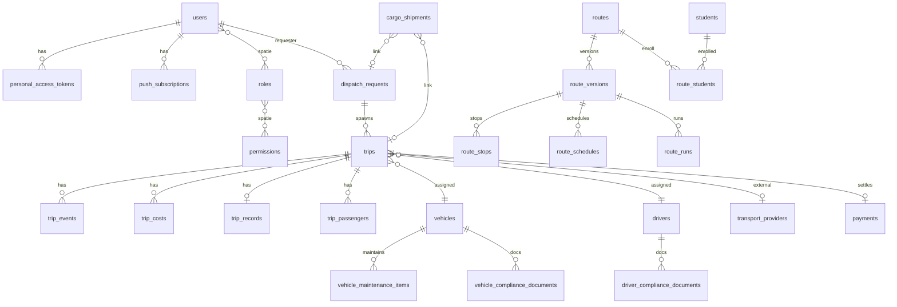

# DATABASE_SPECIFICATION — VA Điều Vận

## 📑 Mục lục

- [Nguồn sự thật](#nguồn-sự-thật)
- [ERD (Mermaid)](#erd-mermaid)
- [Bảng framework & auth](#bảng-framework--auth)
- [RBAC Spatie](#rbac-spatie)
- [Người dùng & thông báo](#người-dùng--thông-báo)
- [Vận hành: xe, tài xế, NCC](#vận-hành-xe-tài-xế-ncc)
- [Yêu cầu điều xe & chuyến](#yêu-cầu-điều-xe--chuyến)
- [Chi phí, nhật ký, đính kèm](#chi-phí-nhật-ký-đính-kèm)
- [Hàng hóa](#hàng-hóa)
- [Tuyến D2D & học sinh](#tuyến-d2d--học-sinh)
- [Tài chính](#tài-chính)
- [Giá tham chiếu](#giá-tham-chiếu)
- [Hệ thống: toggle, audit, idempotency, queue](#hệ-thống-toggle-audit-idempotency-queue)
- [Bảo trì xe](#bảo-trì-xe)
- [Chiến lược DB](#chiến-lược-db)

---

## Nguồn sự thật

Toàn bộ schema được định nghĩa trong [database/migrations/](../database/migrations/).  
**Lưu ý:** Migration `2026_04_02_000001_create_roles_and_permissions_tables.php` tạo RBAC **legacy**; sau đó `2026_04_14_000001_drop_legacy_rbac_tables.php` **xoá** các bảng đó và chuyển sang **Spatie** (`2026_04_14_000002_create_permission_tables.php`).

> **Multi-tenant:** Không tìm thấy cột `tenant_id` / chiến lược đa tenant trong migrations — hệ thống được mô hình hoá như **đơn tenant** (một tổ chức).

---

## ERD Mermaid

---

## Bảng framework & auth

### `users`

| Ý nghĩa | Tài khoản đăng nhập SPA/API |

| Cột | Kiểu | Nullable | Ghi chú |
|-----|------|----------|---------|
| id | bigint PK | No | |
| name | string | No | |
| email | string unique | No | |
| google_id | string unique | Yes | OAuth |
| password | string | No | Sanctum login |
| phone | string | Yes | Profile |
| employee_code | string | Yes | |
| is_active | boolean default true | No | Khóa tài khoản |
| avatar_url | string | Yes | |
| email_verified_at | timestamp | Yes | |
| remember_token | string | Yes | |
| created_at / updated_at | timestamp | Yes | |

### `password_reset_tokens`, `failed_jobs`, `personal_access_tokens`

Chuẩn Laravel — PAT cho Sanctum nằm `personal_access_tokens`.

---

## RBAC Spatie

Bảng chuẩn package (tên lấy từ `config/permission.php`):

- `permissions` — cột bổ sung: `display_name`, `plain_description` (migration `2026_04_15_000001_*`)
- `roles` — `display_name`
- `model_has_permissions`, `model_has_roles`, `role_has_permissions`

Guard mặc định dùng trong seed: **`web`**.

---

## Người dùng & thông báo

### `notifications`

| Cột | Kiểu |
|-----|------|
| id | uuid PK |
| type | string |
| notifiable_type / notifiable_id | morphs |
| data | text (JSON payload) |
| read_at | timestamp nullable |
| timestamps | |

### `push_subscriptions`

| Cột | Kiểu |
|-----|------|
| id | bigint PK |
| user_id | FK users cascade |
| endpoint_hash | char(64) unique per user |
| endpoint | text |
| content_encoding | string default aesgcm |
| public_key | string |
| auth_token | string |
| timestamps | |

---

## Vận hành: xe, tài xế, NCC

### `vehicles`

Cột gốc: `license_plate` unique, `type`, `seat_count`, `payload_kg`, `status` enum(`ready`,`in_use`,`maintenance`,`broken`), `odometer_km`, `inspection_expires_at`, `insurance_expires_at`, timestamps.  
**Mở rộng:** `default_driver_id` FK, nhiều field chi tiết từ Excel (`2026_04_14_120000_*`), **`deleted_at`** soft delete.

### `drivers`

`user_id` FK nullable, `full_name`, `phone`, `national_id`, `license_class`, `license_expires_at`, `employment_status`, `availability_status`, `odometer_km`, timestamps, index composite status; **`deleted_at`**.

### `transport_providers`

`name`, `type` enum(`vendor`,`taxi`), contact fields, `is_active`, index; mở rộng hợp đồng/dịch vụ (`2026_04_13_120000_*`); **`deleted_at`**.

### `driver_compliance_documents` / `vehicle_compliance_documents`

Theo dõi giấy tờ: `doc_type`, `title`, `notes`, `issued_at`, `expires_at`, FK tới driver/vehicle.

---

## Yêu cầu điều xe & chuyến

### `dispatch_requests`

| Nhóm cột | Chi tiết |
|----------|-----------|
| Người | `requester_id`, `approved_by` |
| Chuyến | `trip_type` enum door_to_door, point_to_point, business, cargo |
| Địa điểm / thời gian | `origin`, `destination`, `depart_at`, `arrive_by` |
| Khách / ghi chú | `passenger_count`, `notes` |
| Trạng thái | `status` draft→cancelled, `rejection_reason` |
| Kênh / giấy | `source_channel`, `is_urgent`, `paper_*`, `urgent_reason`, `urgent_trigger` |
| Khác | `wizard_snapshot` JSON (`2026_04_15_*`), **`deleted_at`** |

### `trips`

Gán `dispatch_request_id`, `dispatcher_id`, `vehicle_id`, `driver_id`, `transport_provider_id`, `external_*_ref`, `status` (pending→incident), thời gian chạy, **`lock_version`**, **`payment_status`**, **`paid_at`**, **`passenger_check_ins` JSON**, **`supplement_transports` JSON**, timestamps + indexes.

### `trip_passengers`

`trip_id`, `name`, `phone`, `note`.

---

## Chi phí, nhật ký, đính kèm

### `trip_records`

Odometer, notes (driver/dispatcher), FK `trip_id`, `created_by`.

### `trip_costs`

`type` **string** (đổi từ enum), `amount`, `currency`, `description`, `receipt_url`, `status` draft→rejected, `confirmed_by/at`, indexes.

### `trip_events`

`type`, `message`, `data` JSON — timeline.

### `attachments`

Polymorphic `attachable_*`, `kind`, `disk`, `path`, meta file; mở rộng **OCR fields**, **`file_binary`** (longBinary).

---

## Hàng hóa

### `cargo_shipments`

Tracking, địa chỉ, khối lượng, **SLA** `sla_due_at`, status lifecycle, timestamps.

---

## Tuyến D2D & học sinh

- `routes`, `route_versions` (version + status draft/approved/archived), `route_stops`
- `students`, `route_students` (enrollment date range)
- `route_schedules` (day_of_week + depart/arrive time)
- `route_runs` (run_date → optional `trip_id`)

---

## Tài chính

### `reconciliation_periods`

`start_date`, `end_date` unique pair, status draft/locked/paid, audit fields.

### `payments`

FK `trip_id` **unique**, `reconciliation_period_id`, amount, status, method, reference, metadata JSON.

---

## Giá tham chiếu

- `passenger_fare_rates`, `cargo_fare_rates`, `pricing_notes`
- `reference_pricing_revisions`: morph `revisionable_*`, `user_id`, `snapshot` JSON, `created_at`

---

## Hệ thống: toggle, audit, idempotency, queue

### `feature_toggles`

`key` unique, `name`, `is_enabled`, `module`; có migration bổ sung cờ maintenance/upgrade.

### `audit_logs`

`actor_id`, `event`, morph `auditable_*`, `before`/`after`/`metadata` JSON.

### `idempotent_requests`

Chống trùng POST: `user_id`, `scope`, `key_hash`, cached response fields.

### `dispatch_settings`

Singleton logical: ngưỡng giờ urgent passenger/cargo (seed default).

### `jobs`

Laravel queue table (`2026_05_08_140000_*`) khi dùng driver `database`.

---

## Bảo trì xe

### `vehicle_maintenance_items`

Loại bảo dưỡng/đăng kiểm, ngày hết hạn, km, chi phí ước tính, reminder flags.

### `maintenance_renewal_logs`

Lịch sử hành động `renewed|updated|noted`, amount, FK item.

### `maintenance_reminders`

Nhắc lịch theo xe/tài xế, `repeat_type` once/weekly/monthly, `remind_at`.

---

## Chiến lược DB

### Normalization

Thực thể tách bạch (xe/TX/NCC/yêu cầu/chuyến/chi phí); giá tham chiếu và revision lưu snapshot JSON có chủ đích để audit pricing.

### Soft delete

`drivers`, `vehicles`, `transport_providers`, `dispatch_requests` — dùng `deleted_at`.  
**Không** soft delete toàn cục trên `trips` trong các migration đã liệt kê — kiểm tra model `Trip` nếu có `SoftDeletes` tại app layer.

### Audit

`audit_logs` + service `AuditLogger` — ghi các sự kiện như `trip.assign`, `cargo.sla_breached`.

### Performance indexes

- `trips`: status + depart_at; vehicle/driver + depart_at
- `dispatch_requests`: requester + depart_at; status + depart_at; urgent composite (`dr_urgent_depart_idx` trong migration optimize)
- `trip_events`, `trip_costs`, `notifications`: index theo FK hoặc read patterns

### Query optimization

- Tránh N+1: eager load trong controller/service khi list chuyến/yêu cầu.
- `DispatchingService` dùng raw overlap SQL khác nhau MySQL vs SQLite — production nên **MySQL**.

---

## Liên quan

- [FEATURES_AND_MODULES.md](./FEATURES_AND_MODULES.md)
- [QUEUE_EVENT_CRON.md](./QUEUE_EVENT_CRON.md)
