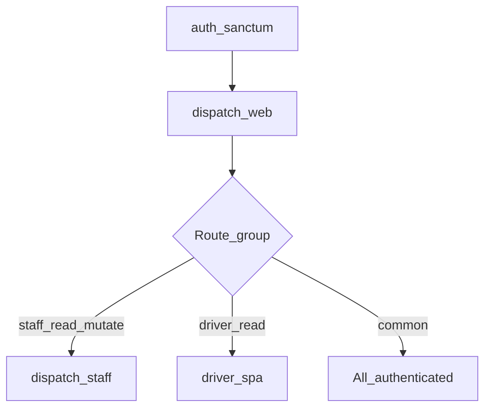

# PERMISSION_AND_ROLE — VA Điều Vận

## 📑 Mục lục

- [Công nghệ](#công-nghệ)
- [Roles](#roles)
- [Danh sách permissions](#danh-sách-permissions)
- [Mapping role → permission](#mapping-role--permission)
- [Middleware & luồng truy cập](#middleware--luồng-truy-cập)
- [Policy](#policy)
- [Frontend](#frontend)
- [Superadmin bootstrap](#superadmin-bootstrap)

---

## Công nghệ

**Spatie Laravel Permission v6** — bảng chuẩn (`permissions`, `roles`, `model_has_roles`, `model_has_permissions`, `role_has_permissions`).  
Guard dùng trong seed: **`web`**.

File cấu hình: [config/permission.php](../config/permission.php).  
Seed chính: [database/seeders/RbacSeeder.php](../database/seeders/RbacSeeder.php).

---

## Roles

| name | display_name (seed) |
|------|---------------------|
| superadmin | Super Admin |
| admin | Admin |
| dispatcher | Dispatcher |
| department_head | Trưởng đơn vị |
| driver | Tài xế |
| accountant | Kế toán |
| internal_user | User nội bộ |

---

## Danh sách permissions

| Permission | Mô tả ngắn (theo key) |
|------------|------------------------|
| request.create | Tạo yêu cầu điều xe |
| request.update_own | Sửa yêu cầu của mình |
| request.cancel_own | Hủy yêu cầu của mình |
| request.approve | Duyệt/từ chối yêu cầu |
| request.fill_price | Điền giá / chọn Trưởng BP duyệt |
| request.approve_dept | Trưởng BP duyệt phiếu (dept-decision) |
| request.paper.manage | Quản lý phiếu giấy |
| trip.assign | Phân công chuyến |
| trip.view_all | Xem mọi chuyến |
| trip.view_own | Xem chuyến liên quan |
| trip.update_status | Đổi trạng thái chuyến |
| trip.record.create | Ghi nhật ký/record |
| trip.event.create | Thêm sự kiện timeline |
| trip.cost.view | Xem chi phí |
| trip.cost.reconcile | Đối soát chi phí |
| payment.reconcile | Đối soát thanh toán |
| payment.execute | Thực hiện thanh toán |
| report.view | Xem báo cáo |
| report.export | Xuất báo cáo |
| cargo.manage | Quản lý hàng hóa |
| route.manage | Quản lý tuyến |
| student.manage | Quản lý học sinh |
| attachment.upload | Upload file đính kèm |
| reference_pricing.manage | Sửa giá tham chiếu |
| resource.driver.manage | CRUD tài xế |
| resource.vehicle.manage | CRUD xe |
| resource.provider.manage | CRUD NCC |
| user.manage | Quản lý user (API admin) |
| audit_log.view | Xem audit |
| data.override_confirmed | Override dữ liệu đã confirmed (chi phí) |
| system.roles.manage | CRUD roles |
| system.permissions.manage | CRUD permissions |
| system.user_roles.manage | Gán role user |
| system.feature_toggles.manage | CRUD feature toggle |
| dispatch.settings.manage | Cấu hình dispatch |
| p2p_policy.view | Xem chính sách P2P (campus, kỳ, tuyến, HS…) |
| p2p_policy.manage | CRUD chính sách P2P |
| p2p_policy.activate | Kích hoạt kỳ P2P |
| p2p_policy.import_export | Import/export danh sách học sinh P2P |

Mô tả tiếng Việt plain-text có thể được hydrate từ `App\Support\PermissionPlainVi` + file JSON (xem `RbacSeeder`).

---

## Mapping role → permission

| Role | Permissions (tóm tắt) |
|------|------------------------|
| internal_user | request.* own, trip.view_own |
| driver | trip ops + cost view + attachment.upload |
| department_head | request.approve_dept, trip.view_own, attachment.upload |
| dispatcher | Gần full nghiệp vụ điều vận + resource + cargo + route + student + reference pricing + fill_price + p2p_policy.* |
| accountant | trip/payment/report + provider + attachment + p2p_policy.view |
| admin | **Toàn bộ** danh sách |
| superadmin | **Toàn bộ** danh sách |

Chi tiết đầy đủ: mảng `$map` trong `RbacSeeder`.

---

## Middleware & luồng truy cập

Đăng ký alias trong [app/Http/Kernel.php](../app/Http/Kernel.php):

| Alias | Class | Ý nghĩa |
|-------|-------|---------|
| `permission` | `EnsureHasPermission` | Spatie `hasPermissionTo` |
| `role` | `EnsureHasRole` | Spatie `hasRole` |
| `dispatch.web` | `EnsureDispatchWebAccess` | Vào được SPA điều vận/driver |
| `dispatch.staff` | `EnsureDispatchStaffAccess` | Staff: superadmin, admin, dispatcher, department_head (không pure-driver-only account) |
| `driver.spa` | `EnsureDriverWebAccess` | Route chỉ cho app tài xế |
| `feature` | `EnsureFeatureEnabled` | Feature toggle |

**Luồng API SPA (rút gọn):**

Ví dụ route-level permission:  
`GET /api/reference-pricing/revisions` → `middleware('permission:reference_pricing.manage')`.

Syntax đặc biệt:  
`permission:any,system.user_roles.manage` trên bulk update roles.

---

## Policy

Logic chi tiết **theo từng FormRequest / Policy** gắn với controller — không gom một file trong tài liệu này. Tra cứu: `app/Policies`, `$this->authorize()` trong controller, và các class trong `app/Http/Requests/Api`.

---

## Frontend

- Login API trả về mảng `permissions`.
- Router: meta `permission`, `featureKey` trong `resources/js/src/router/index.js`.
- Store: `useAuthStore` — helpers kiểm tra quyền và feature toggles.

---

## Superadmin bootstrap

`RbacSeeder` đọc `config('permission.superadmin_email')` (env `SUPERADMIN_EMAIL`, có default trong `config/permission.php`) — nếu user tồn tại thì `assignRole('superadmin')`.

---

## Liên quan

- [API_OVERVIEW.md](./API_OVERVIEW.md)
- [FEATURES_AND_MODULES.md](./FEATURES_AND_MODULES.md)
