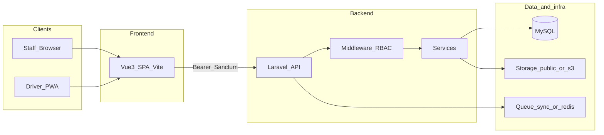
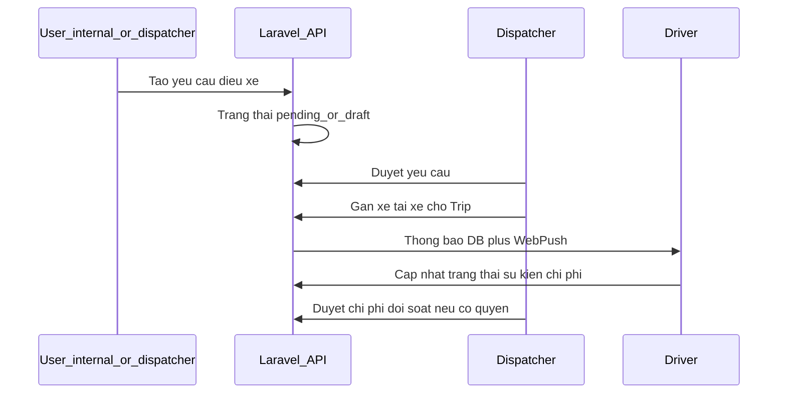

# PROJECT_OVERVIEW — VA Điều Vận (VAS Dispatch)

## 📑 Mục lục

- [Giới thiệu](#giới-thiệu)
- [Mục tiêu hệ thống](#mục-tiêu-hệ-thống)
- [Business domain](#business-domain)
- [Nhóm người dùng chính](#nhóm-người-dùng-chính)
- [Vấn đề hệ thống giải quyết](#vấn-đề-hệ-thống-giải-quyết)
- [Flow hoạt động tổng quát](#flow-hoạt-động-tổng-quát)
- [Công nghệ sử dụng](#công-nghệ-sử-dụng)
- [Kiến trúc tổng thể](#kiến-trúc-tổng-thể)
- [Modules & services chính](#modules--services-chính)
- [Môi trường](#môi-trường)

---

## Giới thiệu

**VA Điều Vận** là hệ thống web **điều phối xe** phục vụ vận hành nội bộ (hành khách, công tác, cửa–cửa/D2D, hàng hóa). Người dùng làm việc qua **SPA Vue** (desktop + PWA cho tài xế); backend **Laravel** cung cấp **REST API** có **Sanctum**, **phân quyền Spatie**, **thông báo + Web Push**.

---

## Mục tiêu hệ thống

| Mục tiêu            | Mô tả                                                                                                                 |
| ------------------- | --------------------------------------------------------------------------------------------------------------------- |
| Chuẩn hóa quy trình | Từ **yêu cầu điều xe** → **duyệt** → **phân công** → **thực hiện chuyến** → **ghi chi phí** → **đối soát/thanh toán** |
| Minh bạch           | Nhật ký thao tác (`audit_logs`), trạng thái chuyến, timeline hàng hóa                                                 |
| Hiệu quả vận hành   | Bảng điều khiển dispatch, workload tài xế, cảnh báo SLA cargo                                                         |
| An toàn truy cập    | RBAC chi tiết, feature toggle, middleware `dispatch.staff` / `driver.spa`                                             |

---

## Business domain

| Thuật ngữ                              | Ý nghĩa (non-tech)                                                      |
| -------------------------------------- | ----------------------------------------------------------------------- |
| **Yêu cầu điều xe (dispatch request)** | Phiếu/người yêu cầu muốn xe vào lúc nào, đi đâu, loại chuyến gì         |
| **Chuyến (trip)**                      | **Thực tế vận chuyển** sau khi đã duyệt/gán xe–tài xế–NCC               |
| **Điều phối**                          | Người **dispatcher/admin** gán tài nguyên, theo dõi chuyến              |
| **Tài xế**                             | Người **cập nhật trạng thái chuyến**, nhật ký, chi phí, upload chứng từ |
| **Hàng hóa (cargo)**                   | Luồng riêng có **SLA** và trạng thái vận chuyển                         |
| **Tuyến D2D / học sinh**               | Quản lý **route**, phiên bản tuyến, lịch chạy, sinh chuyến              |
| **Đối soát / thanh toán**              | Kỳ quyết toán, trạng thái thanh toán theo chuyến                        |

---

## Nhóm người dùng chính

| Nhóm                    | Vai trò kỹ thuật                  | Gợi ý business                                                    |
| ----------------------- | --------------------------------- | ----------------------------------------------------------------- |
| **Super Admin / Admin** | Role Spatie `superadmin`, `admin` | Toàn quyền cấu hình hệ thống, RBAC, feature toggle                |
| **Dispatcher**          | Role `dispatcher`                 | Duyệt yêu cầu, gán xe/tài xế, quản lý tài nguyên vận hành         |
| **Tài xế**              | Role `driver`                     | App tài xế (shell riêng), chuyến của tôi, chi phí, O-POD/chứng từ |
| **Kế toán**             | Role `accountant`                 | Chi phí, đối soát, thanh toán, báo cáo (theo quyền seed)          |
| **Trưởng đơn vị**        | Role `department_head`            | Duyệt phiếu điều xe được chọn (`dept-decision`), xem chuyến liên quan |
| **User nội bộ**         | Role `internal_user`              | Tạo/sửa/hủy **yêu cầu của mình**, xem chuyến liên quan; shell **Portal** (`/portal/*`) |

Chi tiết mapping quyền: [PERMISSION_AND_ROLE.md](./PERMISSION_AND_ROLE.md).

---

## Vấn đề hệ thống giải quyết

1. **Phối hợp nhiều bộ phận** — một nơi cho PM/vận hành/thấy trạng thái chuyến.
2. **Giảm sai sót khi gán** — kiểm tra **trùng lịch xe/tài xế** và **optimistic lock** khi nhiều người thao tác.
3. **Theo dõi chi phí** — tài xế gửi, điều vận/kế toán duyệt/từ chối (theo policy).
4. **Tuân thủ & minh bạch** — audit log, giấy tờ compliance xe/tài xế (theo module).
5. **Thông báo kịp thời** — notification trong app + **Web Push** (PWA).

---

## Flow hoạt động tổng quát

**Flow nghiệp vụ (rút gọn):**

---

## Công nghệ sử dụng

| Lớp          | Công nghệ                                  | Phiên bản / ghi chú                      |
| ------------ | ------------------------------------------ | ---------------------------------------- |
| Runtime      | PHP                                        | ^8.1 ([composer.json](../composer.json)) |
| Framework    | Laravel                                    | ^10.10                                   |
| Auth API     | Laravel Sanctum                            | Personal Access Tokens                   |
| OAuth web    | Laravel Socialite                          | Google redirect `/auth/google`           |
| RBAC         | spatie/laravel-permission                  | ^6.25                                    |
| PDF          | barryvdh/laravel-dompdf                    | Phiếu điều xe                            |
| Push         | minishlink/web-push                        | VAPID                                    |
| Excel        | openspout/openspout                        | Import/export học sinh P2P               |
| Frontend     | Vue 3, Vite 5, Pinia, Vue Router, vue-i18n | [package.json](../package.json)          |
| CSS          | Tailwind CSS                               | Utility-first                            |
| PWA          | vite-plugin-pwa                            | injectManifest `resources/js/src/sw.js`  |
| Charts / map | ECharts, Leaflet                           | SPA                                      |

---

## Kiến trúc tổng thể

- **Monolith modular**: một codebase Laravel; API chia nhóm route trong `routes/api/spa/*.php`.
- **SPA**: Blade chỉ là shell (`welcome.blade.php`); logic UI ở `resources/js/src/`.
- **Controller mỏng — Service xử lý nghiệp vụ** (ví dụ `DispatchingService` gán chuyến).

Chi tiết: [SYSTEM_ARCHITECTURE.md](./SYSTEM_ARCHITECTURE.md).

---

## Modules & services chính

| Module (business)      | Gợi ý file / entry                                                          |
| ---------------------- | --------------------------------------------------------------------------- |
| Auth & session API     | `AuthController`, `routes/api.php`                                          |
| Portal (user nội bộ)   | `Portal\PortalDispatchRequestController`, `routes/api.php` (`/api/portal/*`) |
| Hồ sơ user             | `UserProfileController`                                                     |
| Yêu cầu điều xe        | `DispatchRequestController`, `RequestController`                            |
| Chuyến & timeline      | `TripController`, `TripOpsController`                                       |
| Chi phí                | `TripCostController`, `CostCalculationService` (khung)                      |
| Hàng hóa               | `CargoController`, command `cargo:sla-check`                                |
| Tuyến D2D              | `D2D\RouteController`                                                       |
| Chính sách P2P         | `P2pPolicy\*Controller`, `Services/P2pPolicy/`                              |
| Tài nguyên (xe/TX/NCC) | `OperationalResourceController`                                             |
| Compliance             | `DriverComplianceDocumentController`, `VehicleComplianceDocumentController` |
| Báo cáo                | `ReportController`                                                          |
| Giá tham chiếu         | `ReferencePricingController`                                                |
| Admin RBAC             | `Admin\RoleController`, `PermissionController`, `UserRoleController`        |
| Feature toggle         | `FeatureToggleController`, `FeatureToggleService`                           |
| Push                   | `PushSubscriptionController`, `WebPushSender`                               |
| Audit                  | `AuditLogger`, `AuditLogController`                                         |

---

## Môi trường

| Môi trường               | Đặc điểm                                                                         |
| ------------------------ | -------------------------------------------------------------------------------- |
| **Local**                | `QUEUE_CONNECTION=sync` (mặc định `.env.example`), Vite dev                      |
| **Staging / Production** | MySQL, Redis hoặc DB queue khuyến nghị; worker Supervisor; build `npm run build` |

Hướng dẫn cài đặt: [ENVIRONMENT_SETUP.md](./ENVIRONMENT_SETUP.md).

Portal UX/API chi tiết: [PORTAL_NEW_STRUCTURE.md](./PORTAL_NEW_STRUCTURE.md).

---

## Ghi chú tài liệu

- Nội dung **bám source** trong repo `va-dieuvan`. Phần không thấy implementation sẽ được ghi rõ trong các file liên quan (ví dụ SMS gateway không có trong `composer.json`).

