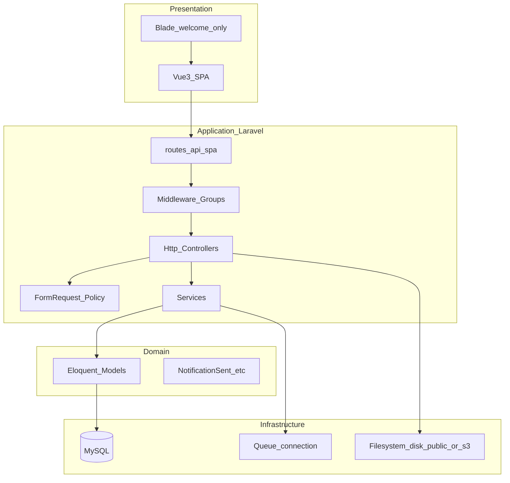
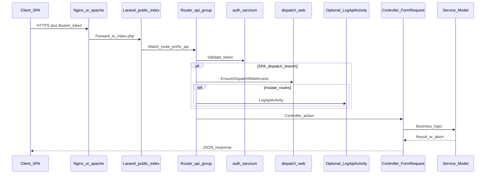
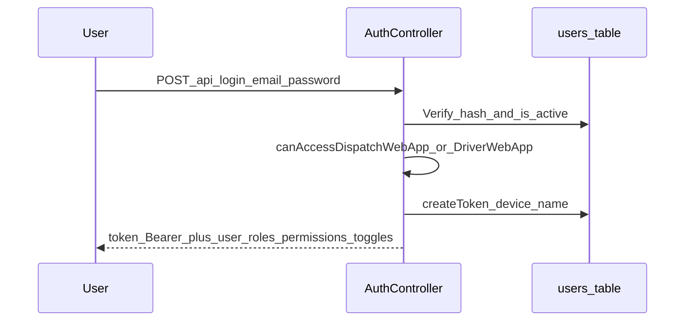
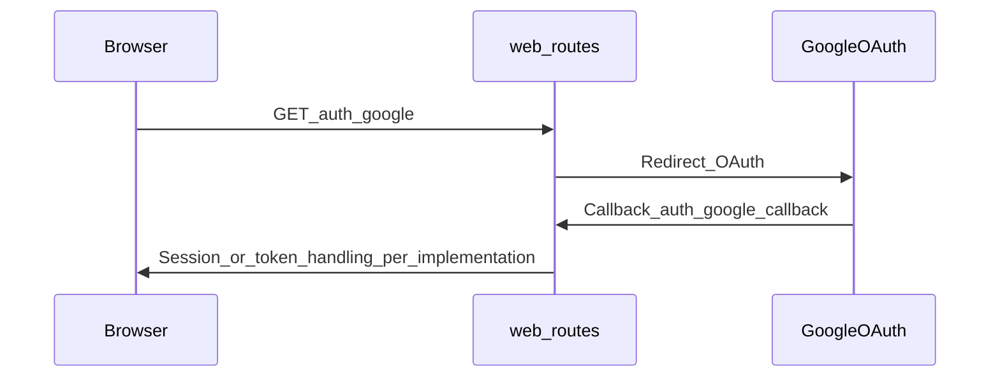
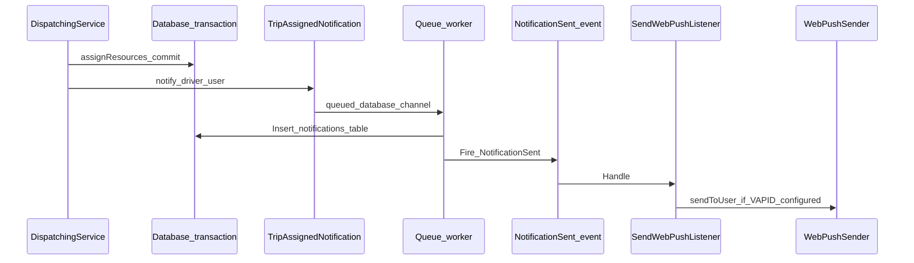

# SYSTEM_ARCHITECTURE — VA Điều Vận

## 📑 Mục lục

- [Tổng quan](#tổng-quan)
- [Architecture pattern](#architecture-pattern)
- [Layer architecture](#layer-architecture)
- [Request lifecycle](#request-lifecycle)
- [Authentication flow](#authentication-flow)
- [Queue & notification flow](#queue--notification-flow)
- [Cache & session](#cache--session)
- [File upload & storage](#file-upload--storage)
- [Logging & telemetry](#logging--telemetry)
- [Phân tích: ưu/nhược/mở rộng](#phân-tích-ưunhược-mở-rộng)

---

## Tổng quan

Hệ thống là **ứng dụng full-stack**: **Laravel 10 (API)** + **Vue 3 SPA** build bằng **Vite**. Không dùng Inertia; Blade chỉ là mount point cho SPA và template PDF.

---

## Architecture pattern

| Khía cạnh   | Lựa chọn trong source                                                   |
| ----------- | ----------------------------------------------------------------------- |
| Triển khai  | **Monolith** (một repo, một deploy unit)                                |
| Tổ chức API | **Modular routes** — nhóm theo `routes/api/spa/*.php`                   |
| Nghiệp vụ   | **Service layer** (`app/Services/`**) + Controller mỏng                 |
| Frontend    | **Feature-based structure** (`views/`, `components/`, `store/`, `api/`) |

---

## Layer architecture

| Layer                         | Trách nhiệm                                                                              | Ví dụ                                                        |
| ----------------------------- | ---------------------------------------------------------------------------------------- | ------------------------------------------------------------ |
| **Routes**                    | Ánh xử URL → middleware → controller                                                     | `routes/api.php`, `routes/api/spa/*`                         |
| **Middleware**                | Auth Sanctum, role (`dispatch.staff`, `driver.spa`), throttle, idempotency, log activity | `app/Http/Middleware/*`, aliases trong `app/Http/Kernel.php` |
| **HTTP**                      | Validate input (FormRequest), authorize (policy), trả JSON                               | `app/Http/Controllers/Api/`**                                |
| **Services**                  | Luật nghiệp vụ, transaction, audit                                                       | `DispatchingService`, `AuditLogger`, `WebPushSender`         |
| **Models**                    | Eloquent, quan hệ                                                                        | `app/Models/`**                                              |
| **Notifications / Listeners** | Thông báo `database` + hook Web Push                                                     | `app/Notifications/`*, `SendWebPushOnDatabaseNotification`   |

---

## Request lifecycle

**Ghi chú throttle:** nhóm route đọc/ghi có `throttle` khác nhau (ví dụ `120,1` đọc nhẹ, `180,1` ghi có log) — xem `routes/api.php` và file spa.

---

## Authentication flow

### 1) Đăng nhập API (email/password + Sanctum)

- Controller: `App\Http\Controllers\Api\Auth\AuthController::login`
- Token: **Bearer** trong header `Authorization` (Sanctum personal access token).

### 2) Google OAuth (web redirect)

- Routes: `routes/web.php` — `GoogleAuthController@redirect`, `@callback`.

---

## Queue & notification flow

- **Không có custom Job** trong `app/Jobs/` (thư mục trống trong khảo sát codebase).
- **Hàng đợi thực tế**: class `Notification` implement `ShouldQueue` / `ShouldQueueAfterCommit`.

- Queue name: `config/dispatch.php` — `notifications_queue_default`, `notifications_queue_urgent`.
- Listener: `App\Listeners\SendWebPushOnDatabaseNotification` đăng ký trong `EventServiceProvider`.

---

## Cache & session

| Thành phần              | Mặc định `.env.example` | Ghi chú                                                  |
| ----------------------- | ----------------------- | -------------------------------------------------------- |
| `CACHE_DRIVER`          | `file`                  | Có thể chuyển `redis` production                         |
| `SESSION_DRIVER`        | `file`                  | API SPA chủ yếu **token**, session chủ yếu cho web/oauth |
| Spatie permission cache | `config/permission.php` | Có thể cần `permission:cache-reset` khi đổi quyền        |

---

## File upload & storage

- **Polymorphic `attachments`**: `attachable_type`, `attachable_id`, `disk`, `path`, `mime_type`, …
- Upload routes: `AttachmentController` (`POST /api/attachments`, nhận chứng từ/OCR…) trong nhóm mutate driver/staff tùy route file.
- Disk: `FILESYSTEM_DISK` — local `public` hoặc S3 (env `AWS_`* có trong `.env.example`).  
- **PDF**: export phiếu điều xe qua DomPDF + Blade `resources/views/pdf/dispatch-request.blade.php`.

---

## Logging & telemetry

| Loại                   | Source                                                       |
| ---------------------- | ------------------------------------------------------------ |
| **Audit nghiệp vụ**    | `App\Services\Auditing\AuditLogger` → bảng `audit_logs`      |
| **API activity**       | Middleware `LogApiActivity` trên nhóm mutate                 |
| **Debug notification** | `config/dispatch.php` — `debug_notification_log`             |
| **Client telemetry**   | `POST /api/telemetry/frontend` — `ClientTelemetryController` |

---

## Phân tích: ưu/nhược/mở rộng

### Ưu điểm

- **Một codebase**, dễ triển khai SME/enterprise vừa và nhỏ.
- **RBAC + Feature toggle** tách bật chức năng theo role và cờ hệ thống.
- **Idempotency** + **optimistic lock** giảm double-submit và ghi đè.

### Nhược điểm / rủi ro

- **Monolith**: scale ngang API cần chiến lược session/cache/queue rõ ràng.
- **Sync queue local**: dễ hiểu nhầm “thông báo không chạy” nếu production quên worker.

### Khả năng mở rộng

- Tách **queue Redis**, **Horizon**, **read replica** MySQL khi tải lớn.
- **Object storage** (S3) cho attachment khi dung lượng tăng.
- **CDN** cho `public/build` sau Vite build.

### Performance strategy (đã có trong code/schema)

- Index trên `trips` (`status`, `depart_at`, `vehicle_id`, `driver_id`), migration tối ưu `planned_end` / query (xem `2026_04_02_000060_`*).
- Chunk manual trong Vite cho `echarts`, `vue-router`, `pinia` — giảm payload driver shell.

---

## Liên quan

- [PROJECT_OVERVIEW.md](./PROJECT_OVERVIEW.md)
- [QUEUE_EVENT_CRON.md](./QUEUE_EVENT_CRON.md)
- [PERMISSION_AND_ROLE.md](./PERMISSION_AND_ROLE.md)

