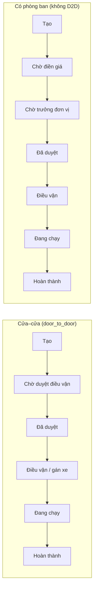

# Brief — Thiết kế lại trang Chi tiết yêu cầu điều xe (Staff)

**Phạm vi:** Giao diện mới cho `/mng/requests/:id` (ví dụ [requests/289](https://dieuvan.vaschools.edu.vn/mng/requests/289)).

**Mục đích tài liệu:** Mô tả **người dùng, luồng nghiệp vụ, dữ liệu và hành động** cần có — **không** mô tả layout/tab/sidebar của UI cũ. Team thiết kế & dev tự quyết cấu trúc màn hình, điều hướng và component tree.

**Giữ nguyên:** API backend, quyền Spatie, trạng thái domain, BM.03 là nguồn dữ liệu (`wizard_snapshot`). Có thể đổi hoàn toàn cách trình bày (một trang cuộn, wizard, panel phải, v.v.).

---

## 1. Mục tiêu sản phẩm

| Mục tiêu | Mô tả |
|----------|--------|
| **Hiểu nhanh** | Một lần mở trang, người dùng biết: phiếu này ở đâu trong quy trình, ai đề nghị, đi đâu khi nào, việc gì còn thiếu. |
| **Hành động đúng chỗ** | Mỗi vai trò chỉ thấy nút/form họ được phép; hành động nhạy cảm có xác nhận và phản hồi lỗi rõ. |
| **Theo dõi sau duyệt** | Liên kết chặt với **chuyến** (`trip`) và **hồ sơ giấy tờ** (đính kèm, ký, scan, nhận bản cứng). |
| **Chia sẻ link** | URL có thể deep-link tới “việc cần làm” hoặc khối nội dung (query `tab` / `focus` — tên có thể đổi khi redesign). |

**Không phải mục tiêu của redesign:** Đổi quy trình duyệt backend, thay BM.03 bằng form khác, hoặc gộp trang này với chi tiết chuyến (trừ khi product quyết định riêng).

---

## 2. Đối tượng sử dụng

| Vai trò | Việc thường làm trên trang này |
|---------|--------------------------------|
| **Điều vận / admin** | Xem phiếu, duyệt cửa–cửa, điền giá (phiếu có phòng ban), quản lý hồ sơ/OCR/giấy cứng, xuất PDF. |
| **Người đề nghị** (cũng có thể là NV điều vận) | Xem trạng thái, tải PDF, upload phiếu đã ký sau duyệt, **tạo lại phiếu** từ bản đã duyệt/từ chối. |
| **Trưởng đơn vị** | *Thường dùng shell `/dept`* — cùng nghiệp vụ duyệt sau `price_filled`; brief này vẫn liệt kê để parity hoặc gộp một màn staff+dept. |

Điều kiện vào trang: đã đăng nhập, `canAccessDispatchWebApp`, feature `module.operations`.

---

## 3. Khái niệm & luồng nghiệp vụ

### 3.1 Thực thể

- **Yêu cầu điều xe** (`dispatch_request`): một phiếu đề nghị, có `status`, `trip_type`, lộ trình, snapshot wizard BM.03, đính kèm.
- **Chuyến** (`trip`): tạo sau duyệt; trạng thái chuyến ảnh hưởng bước “điều vận / đang chạy / hoàn thành” trên timeline.
- **Phiên bản định kỳ:** có `dispatch_request_template_id` → thêm theo dõi **số học sinh** (kế hoạch vs thực tế); trên `/mng` chỉ **xem**, sửa trên cổng portal.

### 3.2 Trạng thái yêu cầu (UI phải phản ánh)

`draft` → `pending` → (`price_filled` nếu không D2D) → `approved` | `rejected` | `cancelled`.

- `price_filled`: điều vận đã điền giá, chờ trưởng đơn vị (không D2D).
- Sau `approved`: bật xuất PDF; kích hoạt luồng hồ sơ (ký, scan, nhận giấy).

### 3.3 Hai pipeline timeline (bắt buộc phân biệt trong UI)

Timeline cần hiển thị **bước hiện tại**, **đã qua**, **từ chối / hủy** (dừng hoặc đánh dấu lỗi), và **mốc thời gian** khi API có (`created_at`, `price_filled_at`, thời điểm chuyến…).

### 3.4 Loại chuyến (`trip_type`)

Ảnh hưởng nhãn, tải trọng (hàng vs khách), bước duyệt, và nội dung BM.03. UI cần **một nhãn loại chuyến** nhất quán trên toàn trang.

---

## 4. Nội dung bắt buộc (information inventory)

Nhóm dưới đây là **khối thông tin** cần có trên màn hình (cách sắp xếp tùy thiết kế mới).

### 4.1 Định danh & ngữ cảnh

| Dữ liệu | Ghi chú |
|---------|---------|
| Mã hiển thị | Quy ước `REQ-{YYYYMM}-{id}` (client-side từ `id` + `created_at`) |
| `id` nội bộ | Hiện trên BM.03 (#id) |
| Trạng thái | Badge + giải thích ngắn nếu cần |
| Badge **định kỳ** | Khi có `dispatch_request_template_id` |
| Thời gian tạo | `created_at` |
| Liên kết chuyến | Khi `trip` tồn tại → đi tới `/mng/trips/{id}` |
| **Nguồn clone** | Nếu `cloned_from_summary` → link phiếu gốc |

### 4.2 Người đề nghị

Từ `requester` + `wizard_snapshot.form`:

- Họ tên, email, SĐT, mã nhân viên, đơn vị (`requester_unit`).
- Avatar nếu có `avatar_url`.

### 4.3 Lộ trình & thời gian vận hành

- `origin`, `destination` (+ chi tiết cargo: địa điểm/liên hệ pickup/delivery từ `wizard_snapshot.cargoRows` nếu có).
- `depart_at`, `arrive_by` (ngày + khung giờ).
- **Khoảng cách / ước tính chi phí** từ logic client (`useRequestCostEstimate` — có thể gọi lại hoặc thay bằng API tương đương).

### 4.4 Tải / đối tượng

- Số khách: `passenger_count` (và với định kỳ: `student_count_actual`, tracking badge).
- Hàng: khối lượng từ `wizard_snapshot.cargoRows`.
- Mục đích, căn cứ đề xuất, đối tượng sử dụng, cờ gấp + lý do — chủ yếu trong BM.03 snapshot.

### 4.5 Chi phí & cảnh báo

- Tổng khai báo trên phiếu (từ snapshot / cost estimate).
- `service_price` sau khi điều vận điền giá.
- Cảnh báo (nếu API trả): `dispatch_package_cost_alert`, `dispatch_package_budget_alert` — cần **nổi bật**, không chôn trong form dài.

### 4.6 BM.03 — Đề nghị điều vận

- Toàn bộ các mục A, B, C, D, … theo biểu mẫu **MH.QT.04 / BM.03** (read-only trên staff).
- Metadata biểu mẫu: ký hiệu, ngày ban hành (có thể từ settings `dispatch-form-settings`).
- Bảng chi phí theo dòng (rows) nếu có trong snapshot.

### 4.7 Hồ sơ & giấy tờ

Ba luồng logic (UI có thể gộp hoặc tách):

1. **Đính kèm đề xuất** — attachment không phải `signed_paper` / `paper_scan`.
2. **Phiếu đã ký** — file `signed_paper` + entity `signed_document` (OCR, verification).
3. **Giấy cứng** — `paper_scan`, `paper_status` (`pending` / `received`), `paper_reference`, `paper_received_at`.

Checklist trạng thái gợi ý (parity nghiệp vụ):

- Có đính kèm đề xuất?
- Đã có phiếu ký / signed doc hợp lệ? (sau `approved`)
- Đã scan hoặc đã xác nhận nhận giấy?

### 4.8 Số học sinh (chỉ phiếu định kỳ)

- Số kế hoạch vs thực tế, trạng thái tracking.
- **Không** form chỉnh sửa trên `/mng` (chỉ portal).

### 4.9 Từ chối

- Khi `rejected`: tiêu đề phù hợp D2D vs từ chối phòng ban, `rejection_reason`, hành động sao chép lý do.

---

## 5. Hành động người dùng (functional requirements)

Mỗi hành động: điều kiện hiển thị, validation, confirm (nếu cần), kết quả thành công (toast + điều hướng), lỗi API.

### 5.1 Điều hướng

| Hành động | Đích |
|-----------|------|
| Quay lại danh sách | `/mng/requests` |
| Mở chuyến | `/mng/trips/{trip_id}` |
| Mở bảng giá (quản lý) | `/mng/pricing` (nếu có quyền) |
| Clone → tạo mới | `/mng/dispatch-requests/new?replace={cloned_id}` |

### 5.2 Quyết định & giá

| Hành động | Điều kiện | API |
|-----------|-----------|-----|
| **Duyệt / từ chối cửa–cửa** | `pending` + `door_to_door` + (`request.approve` hoặc `trip.view_all`) | Decide (idempotency) |
| **Điền giá** | `pending` + không D2D + `request.fill_price` | Fill price (service_price, rows, dept_head_user_id) |
| **Duyệt / từ chối phòng ban** | `price_filled` + `request.approve_dept` (thường shell dept) | Dept decide (reject bắt buộc lý do) |

Sau duyệt thành công: ưu tiên đưa user tới **chi tiết chuyến** nếu `trip.id` có; không thì toast + gợi ý danh sách chuyến.

### 5.3 Tài liệu

| Hành động | Điều kiện | API / ghi chú |
|-----------|-----------|----------------|
| Xuất PDF đề nghị | Chỉ khi `approved` | Export PDF |
| Upload / xóa đính kèm | `attachment.upload` | Attachments |
| OCR đính kèm | `attachment.upload` | Run OCR |
| Xem trước / tải file | Theo quyền đọc phiếu | Download |
| Upload phiếu đã ký | `approved` + user là `requester` | `signed_paper` |
| OCR lại / verify signed doc | `request.paper.manage` | Signed documents |
| Upload scan giấy | `attachment.upload` | `paper_scan` |
| Xác nhận / cập nhật / hoàn tác nhận giấy | `request.paper.manage` | Mark / revert paper received |

### 5.4 Khác

| Hành động | Điều kiện |
|-----------|-----------|
| **Clone phiếu** | `request.create` + user là requester + `approved` hoặc `rejected` |
| Xem bảng giá tham chiếu | Read-only modal hoặc panel; load `reference-pricing` |

### 5.5 “Việc cần làm” (inbox logic)

Hệ thống cần **danh sách việc mở** (có thể là banner, sidebar, hoặc sticky bar — không bắt buộc tab):

| Việc | Khi nào |
|------|---------|
| Điền giá | Như §5.2 |
| Duyệt phòng ban | Như §5.2 (dept) |
| Thiếu phiếu ký sau duyệt | `approved`, chưa signed doc / file signed |
| Thiếu scan giấy | `approved`, chưa `paper_scan`, user có quyền upload |
| (Tương lai) Chỉnh số khách trên staff | Hiện **tắt** trên `/mng` |

Click một việc → scroll/focus tới vùng form tương ứng (deep-link `focus`).

---

## 6. Ma trận quyền (không đổi khi redesign)

| Permission | Khả năng |
|------------|----------|
| `request.approve` / `trip.view_all` | Duyệt/từ chối D2D |
| `request.fill_price` | Điền giá |
| `request.approve_dept` | Duyệt phòng ban |
| `request.create` | Clone (nếu là requester) |
| `attachment.upload` | Upload, xóa, OCR file thường & scan |
| `request.paper.manage` | Giấy cứng, OCR/verify signed |
| `reference_pricing.manage` | Link quản lý bảng giá |

Ẩn hoàn toàn hành động không có quyền; không hiện disabled gây hiểu nhầm (trừ PDF trước duyệt — có thể ẩn thay vì disable).

---

## 7. Trạng thái giao diện (UX states)

| State | Yêu cầu |
|-------|---------|
| Loading | Skeleton hoặc placeholder — tránh layout shift mạnh |
| Loaded | Đủ inventory §4 + hành động §5 |
| Lỗi tải phiếu | 404 / 403 / lỗi mạng — có CTA quay danh sách |
| Đang xử lý hành động | Khóa nút, tránh double-submit; duyệt D2D dùng idempotency |
| Empty từng khối | Ví dụ: chưa có đính kèm, chưa có chuyến — copy rõ, không để “—” im lặng |
| `rejected` / `cancelled` | Timeline và CTA phù hợp (clone chỉ khi rejected/approved theo rule) |

---

## 8. Hợp đồng dữ liệu (backend — giữ khi làm UI mới)

**Đọc chính**

- `GET /api/dispatch-requests/{id}` — payload đầy đủ (requester, trip, attachments, wizard_snapshot, signed_document, alerts, …).
- `GET /api/dispatch-form-settings` — metadata BM (tuỳ chọn).

**Ghi** — tham chiếu đầy đủ trong `routes/api/spa/` (dispatch-staff-mutate, common-mutate, common-read). Tóm tắt đã liệt kê ở §5.

**Deep-link (đề xuất giữ parity)**

- Query: `tab`, `focus` — map tới vùng nội dung tương ứng sau redesign.

---

## 9. Phạm vi redesign — gợi ý tách việc

| Hạng mục | Gợi ý |
|----------|--------|
| **IA & wireframe** | Gom “timeline + lộ trình” vs “BM.03 + giá” vs “hồ sơ” — có thể 1 cột cuộn + anchor nav thay tab. |
| **Visual** | Hệ thống màu trạng thái, typography BM dài, mobile-first cho điều vận hiện trường. |
| **Component library** | Timeline, file manager, approval bar, cost alert — tái dùng portal/dept nếu gộp shell. |
| **Implementation** | Thay `RequestDetailView.vue` và cây con; giữ composables/API (`useRequestCostEstimate`, `useDispatchRequestDocs`, `api/requests`) nếu phù hợp. |
| **i18n** | Tiếp tục `request_detail.*` hoặc namespace mới — tránh hardcode tiếng Việt trong template. |

### 9.1 Câu hỏi mở (product / design)

1. Có **gộp** màn dept duyệt vào `/mng/requests/:id` một shell không?
2. BM.03: vẫn **mô phỏng giấy** hay **tóm tắt có cấu trúc** + link “xem đầy đủ / PDF”?
3. Hồ sơ: **một timeline dọc** (đề xuất → ký → scan) hay **thư viện file**?
4. Duyệt D2D: luôn **header** hay **panel cố định** khi `pending`?
5. Tự động nhảy tab khi có việc cần làm — giữ hay chỉ highlight + notification?

---

## 10. Checklist parity (acceptance khi ship UI mới)

Dùng để QA so với nghiệp vụ hiện tại, **không** so pixel layout cũ.

- [ ] Hai timeline D2D vs có phòng ban đúng bước và trạng thái lỗi.
- [ ] Duyệt/từ chối D2D, điền giá, duyệt dept (nếu scope gồm dept) đúng điều kiện + API.
- [ ] PDF chỉ sau `approved`.
- [ ] Hồ sơ: upload/OCR/xóa, signed workflow, paper received/revert.
- [ ] Phiếu định kỳ: tab/khối số HS read-only trên staff.
- [ ] Clone, banner clone lineage, rejection banner + copy.
- [ ] Quyền ẩn/hiện đúng ma trận §6.
- [ ] Link chuyến, deep-link focus, idempotency duyệt.
- [ ] Cảnh báo gói chi phí / ngân sách hiển thị khi API có flag.

---

## 11. Tham chiếu kỹ thuật hiện tại (chỉ để trace)

| Mục | Vị trí code (có thể thay thế) |
|-----|-------------------------------|
| View cũ | `resources/js/src/views/requests/RequestDetailView.vue` |
| BM.03 tab | `components/requests/RequestBm03FormTab.vue` |
| Hồ sơ | `components/requests/RequestDocsPanel.vue` |
| Workflow todo | `composables/useRequestWorkflowSteps.js` |
| Domain | `.cursor/rules/domain.mdc`, `docs/DATABASE_SPECIFICATION.md` |

---

*Tài liệu brief redesign — cập nhật khi thay đổi nghiệp vụ API hoặc quyết định product ở §9.1.*
