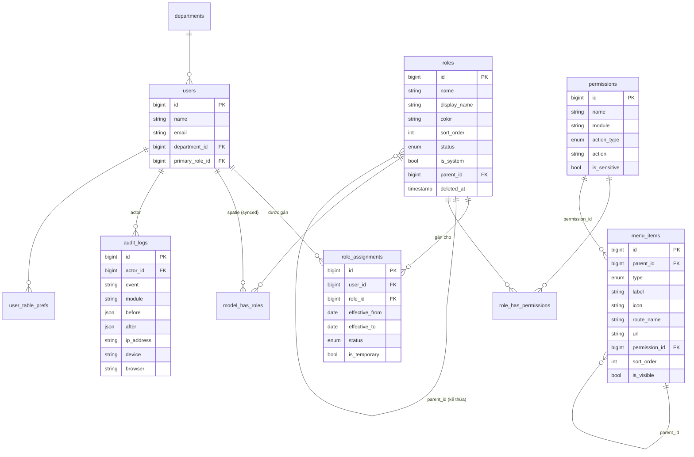

# 03 — Technical Architecture

> Đủ chi tiết để Developer code ngay. Greenfield schema (drop & recreate) + giữ `spatie/laravel-permission` làm engine.
> **Không có Data Scope** (đã chốt bỏ).

## Mục lục

1. [Nguyên tắc kỹ thuật](#1-nguyên-tắc-kỹ-thuật)
2. [Database Design](#2-database-design)
3. [ERD](#3-erd)
4. [Permission Architecture](#5-permission-architecture)  → mục 5
5. [Menu Architecture](#6-menu-architecture) → mục 6
6. [Audit Architecture](#7-audit-architecture) → mục 7
7. [API Specification](#8-api-specification) → mục 8
8. [Migration & Seeding (greenfield)](#9-migration--seeding-greenfield)
9. [Security](#10-security)
10. [File/Folder plan](#11-foldercode-plan)

---

## 1. Nguyên tắc kỹ thuật

- **Engine RBAC:** giữ `spatie/laravel-permission` (bảng `roles`, `permissions`, `model_has_roles`, `model_has_permissions`, `role_has_permissions`). Mở rộng bằng **cột phụ** trên `roles`/`permissions` + bảng phụ (`role_assignments`, `menu_items`, `audit_logs`, `role_change_logs`).
- **Greenfield:** một migration `drop` gỡ toàn bộ bảng RBAC cũ + bảng custom trùng (`role_user`, `permission_role`, `feature_toggles` cũ nếu thay), rồi tạo lại sạch. Kèm seeder + script migrate dữ liệu 7 roles / 41 permissions.
- **API:** REST dưới `/api/...`, guard `auth:sanctum`, prefix nhóm theo quyền. Đặt trong `routes/api/spa/` (theo cấu trúc hiện tại) — gom file mới `system-admin-read.php` + `system-admin-mutate.php`.
- **Authorization:** Policy + middleware `permission:` của Spatie. Sensitive permission qua Gate riêng.
- **Audit:** Observer/Service ghi `audit_logs` cho mọi mutation; middleware bắt IP/UA.
- **Validation:** FormRequest cho mọi mutation.
- **Response:** API Resource (`JsonResource`) chuẩn hóa.

---

## 2. Database Design

> Quy ước: `bigint id PK`, `timestamps`, `softDeletes` nơi cần. Tên cột snake_case.

### 2.1 `roles` (mở rộng bảng Spatie)

| Cột | Kiểu | Null | Mô tả |
|---|---|---|---|
| id | bigint PK | | |
| name | string(125) | | mã vai trò (Spatie), unique theo guard. BR-01 |
| guard_name | string | | `web` |
| display_name | string(150) | ✓ | tên hiển thị |
| description | text | ✓ | mô tả |
| color | string(20) | ✓ | key màu trong palette (vd `indigo`) |
| sort_order | int | ✓ | thứ tự hiển thị (default 0) |
| status | enum(`active`,`locked`) | | default `active`. BR-05 |
| is_system | bool | | default false; true = role hệ thống. BR-02 |
| parent_id | bigint FK→roles | ✓ | kế thừa quyền (AD-07, tùy chọn) |
| created_by / updated_by | bigint FK→users | ✓ | |
| created_at/updated_at | ts | | |
| deleted_at | ts | ✓ | xóa mềm. BR-04 |

Index: `unique(name,guard_name)`, `index(status)`, `index(sort_order)`, `index(parent_id)`.

### 2.2 `permissions` (mở rộng bảng Spatie)

| Cột | Kiểu | Null | Mô tả |
|---|---|---|---|
| id | bigint PK | | |
| name | string(125) | | key `resource.action` (Spatie), unique theo guard |
| guard_name | string | | `web` |
| display_name | string(150) | ✓ | nhãn hiển thị (VI) |
| description / plain_description | text | ✓ | mô tả dễ hiểu (giữ `PermissionPlainVi`) |
| module | string(60) | | nhóm module (vd `hr`,`warehouse`,`procurement`,`dispatch`) |
| action_type | enum(`crud`,`workflow`,`special`) | | phân loại |
| action | string(40) | | `view/create/update/delete/submit/approve/reject/cancel/export/import` |
| is_sensitive | bool | | default false. BR-08 |
| sort_order | int | ✓ | thứ tự trong module |

Index: `unique(name,guard_name)`, `index(module, action_type)`.

> **Quan hệ Role↔Permission**: dùng bảng Spatie `role_has_permissions` (không tự tạo).

### 2.3 `role_assignments` (gán role cho user — thay/đi kèm `model_has_roles`)

> Spatie `model_has_roles` không có thời hiệu. Ta thêm bảng `role_assignments` làm **nguồn sự thật** cho việc gán có thời hạn, và **đồng bộ** sang `model_has_roles` cho các assignment đang hiệu lực (để Spatie tính quyền runtime).

| Cột | Kiểu | Null | Mô tả |
|---|---|---|---|
| id | bigint PK | | |
| user_id | bigint FK→users | | |
| role_id | bigint FK→roles | | |
| effective_from | date | ✓ | null = ngay lập tức |
| effective_to | date | ✓ | null = vô thời hạn. BR-06/07 |
| status | enum(`active`,`expired`,`revoked`) | | |
| is_temporary | bool | | |
| assigned_by | bigint FK→users | ✓ | |
| revoked_by | bigint FK→users | ✓ | |
| revoked_at | ts | ✓ | |
| note | string | ✓ | |
| timestamps | | | |

Index: `unique(user_id, role_id, effective_from)`, `index(status, effective_to)`, `index(user_id)`.

### 2.4 `menu_items` (menu động — thay `feature_toggles` cho phần menu)

| Cột | Kiểu | Null | Mô tả |
|---|---|---|---|
| id | bigint PK | | |
| parent_id | bigint FK→menu_items | ✓ | cha-con (≤3 cấp). BR-09 |
| type | enum(`group`,`item`) | | |
| label | string(120) | | nhãn (i18n key hoặc text) |
| label_key | string(120) | ✓ | khóa i18n (ưu tiên nếu có) |
| icon | string(60) | ✓ | key trong `navIconMap` |
| route_name | string(120) | ✓ | tên route nội bộ |
| url | string(255) | ✓ | URL ngoài (loại trừ với route_name) |
| target | enum(`_self`,`_blank`) | | default `_self` |
| badge_key | string(60) | ✓ | khóa badge (GET /nav/badges) |
| permission_id | bigint FK→permissions | ✓ | gắn quyền hiển thị. BR-11 |
| feature_key | string(80) | ✓ | feature toggle (tương thích hệ cũ) |
| sort_order | int | | |
| is_visible | bool | | default true. BR-10 |
| created_by/updated_by | bigint | ✓ | |
| timestamps + softDeletes | | | |

Index: `index(parent_id, sort_order)`, `index(is_visible)`.

Ràng buộc logic (validate ở app): `route_name XOR url`; `type=group` ⇒ không route/url; độ sâu ≤3; chống cycle.

### 2.5 `audit_logs` (tái thiết kế — tách metadata)

| Cột | Kiểu | Null | Mô tả |
|---|---|---|---|
| id | bigint PK | | |
| actor_id | bigint FK→users | ✓ | nullOnDelete |
| actor_name | string | ✓ | snapshot tên (đề phòng user bị xóa) |
| event | string(100) | | vd `role.update`, `auth.login` |
| module | string(60) | ✓ | nhóm module để filter |
| action | string(40) | ✓ | create/update/delete/login/export… |
| auditable_type | string | ✓ | morph |
| auditable_id | bigint | ✓ | morph |
| before | json | ✓ | snapshot trước |
| after | json | ✓ | snapshot sau |
| result | enum(`success`,`failure`) | | default success |
| ip_address | string(45) | ✓ | **tách ra** |
| user_agent | string(512) | ✓ | UA gốc |
| device | string(80) | ✓ | parse từ UA |
| browser | string(80) | ✓ | parse từ UA |
| os | string(80) | ✓ | parse từ UA |
| metadata | json | ✓ | còn lại (reason, batch_id…) |
| created_at | ts | | (chỉ created_at; append-only, không updated_at) |

Index: `index(auditable_type, auditable_id)`, `index(event, created_at)`, `index(actor_id, created_at)`, `index(module, created_at)`, `index(ip_address)`.

> Append-only: không expose update/delete. Purge theo retention bằng cron riêng.

### 2.6 `role_change_logs` (lịch sử vai trò — tùy chọn; hoặc derive từ audit_logs)

> Khuyến nghị: **không** tạo bảng riêng — dùng `audit_logs` filter theo `auditable_type=Role, auditable_id=:id` cho tab "Lịch sử". Giữ schema gọn.

### 2.7 `user_table_prefs` (lưu layout cá nhân Data Table)

| Cột | Kiểu | Mô tả |
|---|---|---|
| id | bigint PK | |
| user_id | FK→users | |
| table_key | string(80) | định danh bảng (vd `system.roles`) |
| columns | json | thứ tự + ẩn/hiện cột |
| saved_filters | json | bộ lọc đã lưu |
| default_filter_id | string | bộ lọc mặc định |
| timestamps | | |

Index: `unique(user_id, table_key)`.

### 2.8 Bảng GỠ (greenfield drop)

Gỡ các bảng custom trùng lặp với Spatie (từ migration `2026_04_02_000001`): `role_user`, `permission_role`, và bảng `roles`/`permissions` bản custom (nếu khác Spatie). Giữ/đồng bộ `departments`, `users`. `feature_toggles`: giữ cho feature flags chung, nhưng phần "menu on/off" chuyển sang `menu_items.is_visible`.

---

## 3. ERD



---

## 5. Permission Architecture

### 5.1 Quy ước key

`<resource>.<action>` — chữ thường, `_` cho ghép từ. Action chuẩn:

| Nhóm | Action keys |
|---|---|
| **CRUD** | `view`, `create`, `update`, `delete` |
| **Workflow** | `submit`, `approve`, `reject`, `cancel` |
| **Special** | `export`, `import`, `manage` (gộp), `*.grant_sensitive` |

Mỗi permission lưu `module`, `action_type`, `action` để dựng Matrix/nhóm tự động.

### 5.2 Module catalog (đề xuất, ví dụ theo spec)

| module | Nhãn | Resource ví dụ | Actions |
|---|---|---|---|
| `hr` | Nhân sự | `hr_employee` | view, create, update, delete, export, import, approve, cancel |
| `warehouse` | Kho | `warehouse_stock` | view, create, export(xuất kho), import(nhập kho), transfer(điều chuyển) |
| `procurement` | Mua sắm | `procurement_request` | submit(đề xuất), approve(phê duyệt), reject(từ chối) |
| `dispatch` | Điều vận | `request`,`trip`,`trip_cost` | (giữ từ hệ hiện tại) |
| `system` | Hệ thống | `role`,`permission`,`assignment`,`menu`,`audit` | view/manage… |

> `warehouse.transfer` là `action_type=special, action=transfer`. Có thể mở rộng action mới tự do — Matrix tự render theo `module`+`action_type`.

### 5.3 Permission của chính module System (cần seed)

```
system.dashboard.view
role.view  role.create  role.update  role.delete  role.clone
permission.view  permission.sync  permission.grant_sensitive   (is_sensitive=true)
assignment.view  assignment.assign  assignment.revoke
menu.view  menu.manage
audit.view  audit.export
```

### 5.4 Mapping permission cũ → mới (để migrate)

| Key cũ (41) | Key mới |
|---|---|
| `system.roles.manage` | tách → `role.view/create/update/delete` |
| `system.permissions.manage` | `permission.view/sync` |
| `system.user_roles.manage` | `assignment.view/assign/revoke` |
| `system.feature_toggles.manage` | `menu.view/manage` |
| `audit_log.view` | `audit.view` |
| `permission.superadmin_email` | giữ (config-based) |
| `request.*`, `trip.*`, `cargo.*`, `route.*`, `student*`, `policy_trip.*`, `payment.*`, `report.*`, `resource.*`, `reference_pricing.manage`, `school_calendar.manage`, `data.override_confirmed`, `attachment.upload`, `user.manage`, `dispatch.settings.manage` | **giữ nguyên**, chỉ bổ sung cột `module/action_type/action` |

> Script migrate: tạo các permission mới, gán cho role tương ứng dựa trên ai đang có key cũ, rồi (tùy chọn) xóa key cũ của module system. Chi tiết: mục 9.

### 5.5 Tính Effective Permissions (BR-05)

```
effective(user) =
   ⋃ role.permissions  cho mỗi role mà:
        role.status = active
        AND role không deleted
        AND tồn tại role_assignment(user, role) với status=active
            AND (effective_from is null OR effective_from <= today)
            AND (effective_to   is null OR effective_to   >= today)
   ⋃ (kế thừa: nếu role.parent_id → cộng quyền của chuỗi cha, có chống cycle)
   ⋃ direct model_has_permissions (nếu dùng)
```
- Đồng bộ sang Spatie `model_has_roles`: chỉ insert role đang hiệu lực; cron gỡ role hết hạn. Cache permission của Spatie tự invalidate khi sync.

---

## 6. Menu Architecture

### 6.1 Từ tĩnh → động

- Hiện tại: `resources/js/src/config/nav.js` (tĩnh) + `feature_toggles` (on/off) + RBAC qua `useNavSections`.
- Mới: `menu_items` (DB) là nguồn sự thật. `nav.js` chỉ còn **icon map** + fallback seed ban đầu.

### 6.2 API menu của user

`GET /api/menu/me` → trả cây menu đã:
1. Lọc `is_visible=true` (effective theo cha).
2. Lọc theo permission (`permission_id` null hoặc user có quyền).
3. Lọc theo feature toggle (`feature_key`).
4. Sắp theo `sort_order`, lồng theo `parent_id`.
5. Gắn badge runtime (từ `/nav/badges`).

Response cache theo user + `ETag`/`version` (invalidate khi admin lưu menu).

### 6.3 Reorder

`PATCH /api/admin/menu/reorder` nhận mảng `[{id, parent_id, sort_order}]` (batch, transaction). Validate độ sâu ≤3 + chống cycle phía server.

### 6.4 Seed menu ban đầu

Seeder chuyển `NAV_SECTIONS` (từ `nav.js`) thành bản ghi `menu_items` (group → item), map `featureKey`/`permission` hiện có.

---

## 7. Audit Architecture

### 7.1 Ghi log

- **Trait `Auditable`** trên model (Role, Permission, MenuItem, RoleAssignment…) qua Observer → tự ghi create/update/delete với before/after (dùng `getChanges()`/`getOriginal()`).
- **Service `AuditLogger::log($event, $module, $action, $auditable, $before, $after, $meta)`** cho action không gắn model (login, export…).
- **Middleware `CaptureRequestContext`**: lấy `ip`, `user_agent`, parse `device/browser/os` (thư viện UA parser nhẹ), nhét vào context để Logger dùng.

### 7.2 Diff Viewer (FE)

- Nhận `before`/`after` JSON → so sánh theo key:
  - key chỉ ở after = **thêm** (xanh), chỉ ở before = **xóa** (đỏ), khác giá trị = **đổi** (vàng).
  - Mảng (vd permissions) so theo phần tử (added/removed).

### 7.3 Sự kiện tối thiểu theo dõi (BR-12)

`auth.login`, `auth.logout`, `auth.login_failed`, `*.create`, `*.update`, `*.delete`, `*.import`, `*.export`, `*.approve`, `*.reject`, `role.clone`, `permission.sync`, `assignment.assign`, `assignment.revoke`, `menu.reorder`.

### 7.4 Retention

Cron `audit:purge` xóa log > N tháng (config). Không xóa qua UI.

---

## 8. API Specification

> Base: `/api`. Auth: `auth:sanctum`. Lỗi: chuẩn Laravel (`422` validation, `403` forbidden, `409` conflict). Mọi mutation → audit.

### 8.1 Roles

| Method | Endpoint | Permission | Mô tả |
|---|---|---|---|
| GET | `/admin/roles` | `role.view` | List (search, filter status, sort, paginate) |
| GET | `/admin/roles/{role}` | `role.view` | Chi tiết + counts |
| POST | `/admin/roles` | `role.create` | Tạo |
| PUT | `/admin/roles/{role}` | `role.update` | Sửa |
| DELETE | `/admin/roles/{role}` | `role.delete` | Xóa mềm |
| POST | `/admin/roles/{role}/restore` | `role.delete` | Khôi phục |
| POST | `/admin/roles/{role}/clone` | `role.clone` | Clone (body: `with_permissions`) |
| POST | `/admin/roles/{role}/copy-permissions` | `role.update` | Sao chép quyền từ `source_role_id` |
| POST | `/admin/roles/{role}/lock` · `/unlock` | `role.update` | Khóa/Mở |
| GET | `/admin/roles/{role}/history` | `role.view` | Lịch sử (từ audit_logs) |
| GET | `/admin/roles/trashed` | `role.view` | Thùng rác |

**POST /admin/roles** — request:
```json
{ "name":"warehouse_manager", "display_name":"Quản lý kho",
  "description":"...", "color":"emerald", "sort_order":5, "parent_id":null }
```
Response `201`:
```json
{ "data": { "id":12, "name":"warehouse_manager", "display_name":"Quản lý kho",
  "color":"emerald","sort_order":5,"status":"active","is_system":false,
  "permissions_count":0,"users_count":0,"updated_at":"2026-06-04T10:00:00Z" } }
```

**GET /admin/roles** — query: `?q=&status=&sort=-updated_at&page=1&per_page=25`
```json
{ "data":[ /* roles */ ],
  "meta":{ "current_page":1,"per_page":25,"total":7,"last_page":1 } }
```

### 8.2 Permissions (Matrix)

| Method | Endpoint | Permission | Mô tả |
|---|---|---|---|
| GET | `/admin/permissions` | `permission.view` | List permission (group by module/action_type) |
| GET | `/admin/permissions/matrix` | `permission.view` | Ma trận: roles × permissions + giá trị hiện tại |
| POST | `/admin/permissions/sync` | `permission.sync` | Lưu batch thay đổi (atomic) |

**GET /admin/permissions/matrix** → 
```json
{ "roles":[{"id":1,"name":"admin","color":"violet"}, ...],
  "modules":[
    { "module":"hr","label":"Nhân sự",
      "groups":[
        { "action_type":"crud","permissions":[
            {"id":101,"name":"hr_employee.view","label":"Xem","is_sensitive":false},
            {"id":102,"name":"hr_employee.create","label":"Tạo"} ]},
        { "action_type":"workflow","permissions":[ ... ]}
      ]}
  ],
  "matrix": { "1": [101,102,103], "2":[101] }   // role_id -> [permission_id...]
}
```

**POST /admin/permissions/sync** — request (chỉ gửi delta):
```json
{ "changes":[
    {"role_id":2,"grant":[103,104],"revoke":[101]},
    {"role_id":5,"grant":[201]} ] }
```
Response `200`: `{ "applied": 4, "audit_id": 9981 }` — thực thi trong transaction; lỗi → `422` rollback.

### 8.3 Role Assignment

| Method | Endpoint | Permission | Mô tả |
|---|---|---|---|
| GET | `/admin/assignments/users` | `assignment.view` | List user + roles (filter dept/role/q, paginate) |
| GET | `/admin/assignments/users/{user}` | `assignment.view` | Panel: roles + effective permissions |
| POST | `/admin/assignments` | `assignment.assign` | Gán 1 user (role_ids, from/to, temporary) |
| POST | `/admin/assignments/bulk` | `assignment.assign` | Gán hàng loạt (user_ids[]/department_id, role_ids[], from/to) |
| POST | `/admin/assignments/revoke` | `assignment.revoke` | Thu hồi (user_ids[], role_id) |
| GET | `/admin/assignments/users/{user}/effective-permissions` | `assignment.view` | Quyền thực tế + nguồn |

**POST /admin/assignments** :
```json
{ "user_id":42, "role_ids":[2,5], "is_temporary":true,
  "effective_from":"2026-06-04", "effective_to":"2026-06-30", "note":"backup" }
```
**POST /admin/assignments/bulk** :
```json
{ "scope":{"department_id":3}, "role_ids":[2], "is_temporary":false }
```
> Bulk >100 user → `202 Accepted` + `{job_id}`; FE poll `/admin/jobs/{job_id}`.

**GET …/effective-permissions** →
```json
{ "data":[
   {"permission":"trip.assign","label":"Phân công chuyến","via":["dispatcher"]},
   {"permission":"role.view","label":"Xem vai trò","via":["admin"]} ] }
```

### 8.4 Menu

| Method | Endpoint | Permission | Mô tả |
|---|---|---|---|
| GET | `/menu/me` | (auth) | Menu của user hiện tại (đã lọc) |
| GET | `/admin/menu` | `menu.view` | Toàn bộ cây (admin) |
| POST | `/admin/menu` | `menu.manage` | Tạo group/item |
| PUT | `/admin/menu/{item}` | `menu.manage` | Sửa |
| DELETE | `/admin/menu/{item}` | `menu.manage` | Xóa mềm |
| PATCH | `/admin/menu/reorder` | `menu.manage` | Sắp xếp/đổi cấp batch |
| GET | `/admin/menu/preview?role_id=` | `menu.view` | Xem trước menu theo role |

**PATCH /admin/menu/reorder** :
```json
{ "items":[ {"id":5,"parent_id":null,"sort_order":0},
            {"id":8,"parent_id":5,"sort_order":0},
            {"id":9,"parent_id":5,"sort_order":1} ] }
```
Validate: depth ≤3, no cycle → lỗi `422`.

### 8.5 Audit

| Method | Endpoint | Permission | Mô tả |
|---|---|---|---|
| GET | `/admin/audit-logs` | `audit.view` | List (filter time/actor/module/action/ip/q, paginate/infinite) |
| GET | `/admin/audit-logs/{log}` | `audit.view` | Chi tiết + before/after |
| GET | `/admin/audit-logs/export` | `audit.export` | Export theo filter (xlsx/csv); >10k → job |
| GET | `/admin/audit-logs/filters` | `audit.view` | Options cho filter (modules, actions, actors) |

### 8.6 Dashboard

| Method | Endpoint | Permission | Mô tả |
|---|---|---|---|
| GET | `/admin/system-dashboard` | `system.dashboard.view` | Tổng hợp số liệu widget (cache 60s) |

```json
{ "stats": {"users":1248,"roles":7,"permissions":41,"logins_today":312},
  "top_users":[{"user":"Nguyễn A","actions":142}],
  "anomalies":[{"type":"login_failed","count":5,"user":"X"}],
  "security_alerts":[{"type":"sensitive_grant","role":"admin","at":"..."}] }
```

### 8.7 Table Prefs

| Method | Endpoint | Mô tả |
|---|---|---|
| GET | `/me/table-prefs/{table_key}` | Lấy layout cá nhân |
| PUT | `/me/table-prefs/{table_key}` | Lưu cột + saved filters |

---

## 9. Migration & Seeding (greenfield)

### 9.1 Thứ tự migration

1. `xxxx_drop_legacy_rbac_tables` — gỡ `role_user`, `permission_role` (+ bảng custom trùng). Giữ Spatie core.
2. `xxxx_extend_roles_table` — thêm `color, sort_order, status, is_system, parent_id, created_by, updated_by, softDeletes`.
3. `xxxx_extend_permissions_table` — thêm `module, action_type, action, is_sensitive, sort_order` (giữ `display_name`, `plain_description`).
4. `xxxx_create_role_assignments_table`.
5. `xxxx_create_menu_items_table`.
6. `xxxx_recreate_audit_logs_table` — drop bảng cũ, tạo lại với cột IP/device/browser/os/result tách riêng. **Backup dữ liệu cũ** sang `audit_logs_archive` nếu cần giữ lịch sử.
7. `xxxx_create_user_table_prefs_table`.

### 9.2 Seeder

- `RbacSeeder` (viết lại): seed module catalog + permission System mới + permission các module nghiệp vụ (gán `module/action_type/action`).
- `MenuSeeder`: chuyển `NAV_SECTIONS` → `menu_items`.
- `SystemRolesSeeder`: 7 role hiện có với `is_system` (superadmin/admin = system), màu, thứ tự.

### 9.3 Script migrate dữ liệu (one-off command)

`php artisan system:migrate-rbac`:
1. Đọc role↔permission cũ (Spatie hiện tại).
2. Tạo permission mới + bổ sung metadata module/action.
3. Map quyền cũ → mới (bảng mục 5.4), gán lại cho từng role.
4. Chuyển `model_has_roles` hiện tại → `role_assignments` (status=active, from=null, to=null).
5. Log kết quả; idempotent (chạy lại không nhân đôi).

### 9.4 Rollback plan

- Mỗi migration có `down()` đầy đủ.
- Trước khi chạy production: `mysqldump` các bảng RBAC + `audit_logs`.
- Cờ feature: bật module mới sau khi seed + smoke test.

---

## 10. Security

| Mối lo | Biện pháp |
|---|---|
| Leo thang đặc quyền | `is_sensitive` permission chỉ Super Admin (Gate); chặn tự gán quyền cao hơn của chính mình |
| Sửa role hệ thống | `is_system` chặn xóa/khóa/đổi mã ở Policy + DB-level guard |
| Bulk gây quá tải | Queue cho bulk >100; rate-limit endpoint (`throttle`) |
| Audit giả mạo | Append-only; không expose update/delete; ghi server-side IP/UA (không tin client) |
| IDOR | Route-model binding + Policy mọi endpoint |
| Mass assignment | FormRequest whitelist; `$fillable` chặt |
| Xem audit nhạy cảm | `audit.view` riêng; che field nhạy cảm (password…) trong before/after |
| CSRF/XSS | Sanctum + sanitize hiển thị; menu `url` validate scheme (chỉ http/https) |
| Cache quyền cũ | Invalidate Spatie permission cache khi sync/assign |

**Phân quyền sensitive (Gate):**
```php
Gate::define('grant-sensitive', fn(User $u) => $u->hasRole('superadmin'));
```

---

## 11. Folder/Code plan

```
app/Http/Controllers/Api/Admin/System/
  ├─ RoleController.php            (CRUD + clone + copy-permissions + lock/restore)
  ├─ PermissionMatrixController.php (matrix + sync)
  ├─ AssignmentController.php      (assign/bulk/revoke/effective)
  ├─ MenuController.php            (CRUD + reorder + preview)
  ├─ SystemDashboardController.php
  └─ (Audit) Api/Audit/AuditLogController.php  (mở rộng)
app/Http/Requests/System/         (FormRequest cho từng action)
app/Http/Resources/System/        (RoleResource, PermissionResource, MenuItemResource, AuditLogResource…)
app/Services/System/
  ├─ AuditLogger.php
  ├─ EffectivePermissionResolver.php
  ├─ RoleAssignmentSyncService.php  (sync role_assignments ↔ model_has_roles)
  └─ MenuTreeService.php
app/Models/                       (Role, Permission, RoleAssignment, MenuItem, AuditLog — cập nhật)
app/Observers/                    (AuditableObserver, RoleObserver, MenuItemObserver)
app/Console/Commands/             (MigrateRbac, AuditPurge, ExpireAssignments)
database/migrations/              (7 migration mục 9.1)
database/seeders/                 (RbacSeeder, MenuSeeder, SystemRolesSeeder)
routes/api/spa/system-admin-read.php
routes/api/spa/system-admin-mutate.php

resources/js/src/views/system/    (thay toàn bộ)
  ├─ SystemDashboardView.vue
  ├─ RolesView.vue
  ├─ PermissionsMatrixView.vue
  ├─ AssignmentsView.vue
  ├─ MenuManagementView.vue
  └─ AuditLogsView.vue            (chuyển từ views/audit)
resources/js/src/components/system/   (DataTable, AppDrawer, MenuTree, DiffViewer, RoleChip, …)
resources/js/src/stores/system/       (Pinia: roles, permissions, assignments, menu, audit)
resources/js/src/router/index.js      (gộp routes về /system/*)
```

**Định tuyến FE:** thay block `system/*` + `audit-logs` hiện tại (router/index.js ~dòng 283–348) bằng nhóm `/system/*` mới với `meta.permission` theo mục [E của BA](./01-ba-business-analysis.md#e-ma-trận-quyền-truy-cập-màn-hình).
